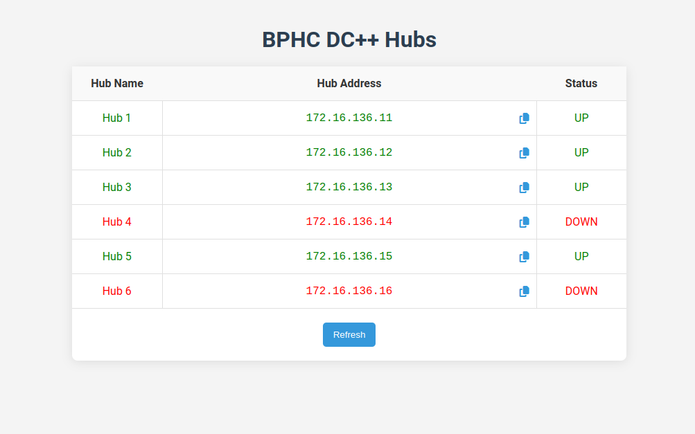

# DC Hub Status

A simple html website that displays the status of the DC Hubs.

## Table of Contents

-   [DC Hub Status](#dc-hub-status)
    -   [Table of Contents](#table-of-contents)
    -   [Development](#development)
        -   [Backend](#backend)
        -   [Frontend](#frontend)

## Development

### Backend

-   Clone the repo
-   Run `pnpm install`
-   To start the server with nodemon, run `pnpm run dev`

### Frontend

-   It's just a html file, open it in any browser
